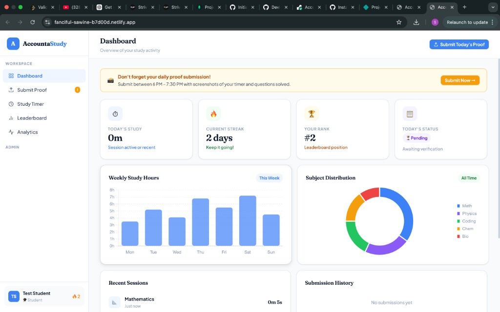
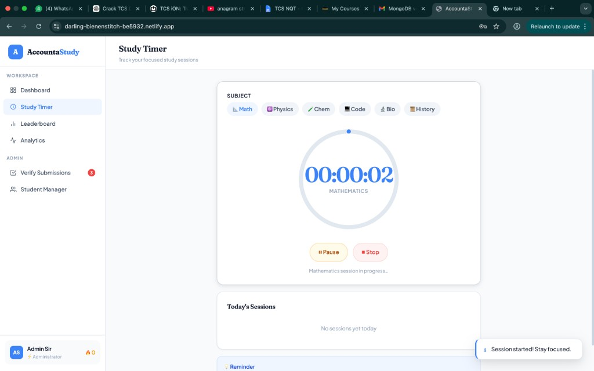
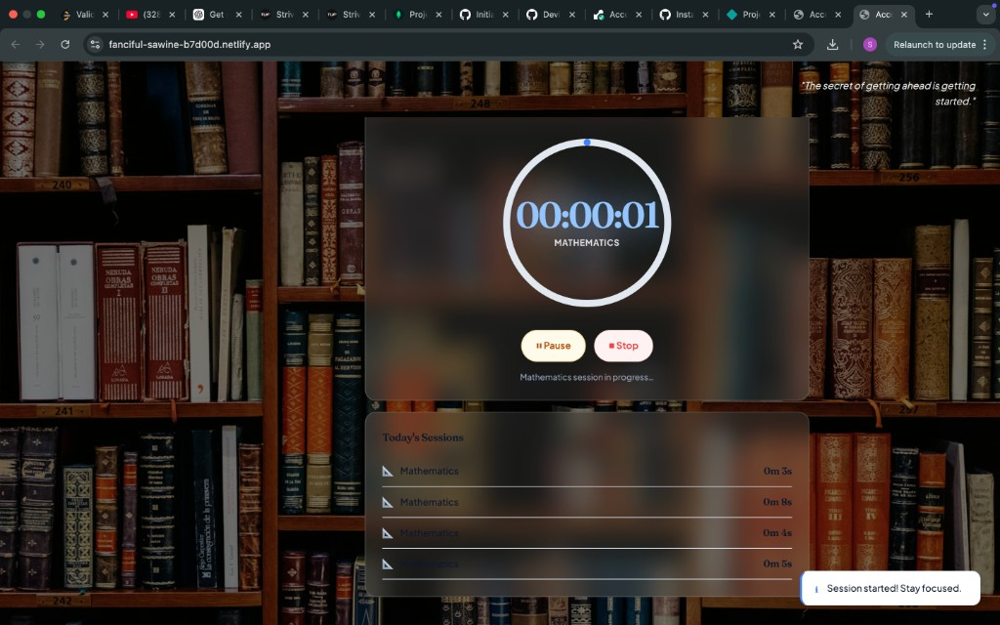
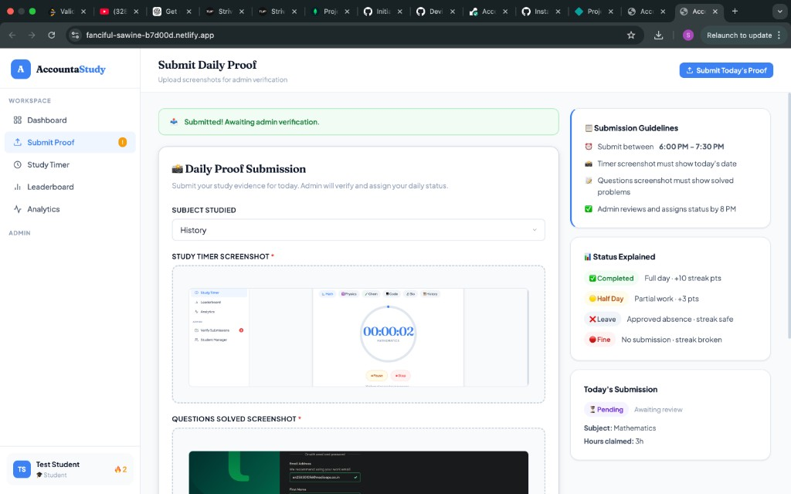
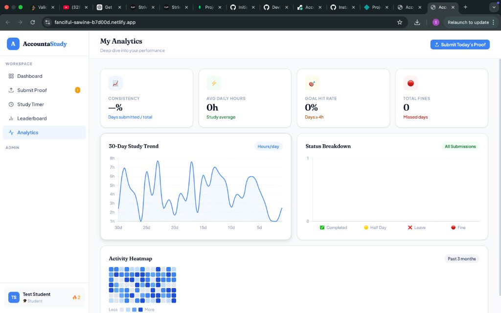

# AccountaStudy — Student Accountability System

A full-stack web application that helps students build and sustain consistent study habits through a structured daily accountability framework. Students submit daily study proof (timer screenshot + question screenshot), earn streaks, compete on a leaderboard, and get verified by an admin.

> **Live Demo:** [https://darling-bienenstitch-be5932.netlify.app](https://darling-bienenstitch-be5932.netlify.app)  
> **Backend API:** [https://accountastudy.onrender.com/api/health](https://accountastudy.onrender.com/api/health)  
> **Project Report:** [`docs/project-report.pdf`](docs/project-report.pdf)

---

## Developer

| Name | Institution | Department |
|------|-------------|------------|
| Sonu Sharma | Medicaps University, Indore | Computer Science & Engineering |

**Guided by:** Prof. Amrata Gupta & Prof. Laxmi Kag  
**HOD:** Prof. (Dr.) Kailash Chandra Bandhu

---

## Technology Stack and Tools Used

| Category | Technology | Version |
|----------|------------|---------|
| Frontend | HTML5, CSS3, Vanilla JavaScript | ES2022 |
| Backend Runtime | Node.js | 18.x LTS+ |
| Backend Framework | Express.js | 4.x |
| Database | MongoDB Atlas (Cloud) | 6.x |
| ODM | Mongoose | 7.x |
| Authentication | JWT (jsonwebtoken) + bcryptjs | Latest |
| File Uploads | Multer | 1.x |
| Dev Server | Nodemon | 3.x |
| Hosting (Backend) | Render.com | — |
| Hosting (Frontend) | Netlify | — |
| IDE | Visual Studio Code | Latest |
| Version Control | Git + GitHub | Latest |

---

## Features and Functionalities Implemented

### Student Features
- Register and login with JWT-based authentication (bcrypt password hashing, cost factor 10)
- Choose student profile type at registration: **Intern** 💼 or **Full-time Aspirant** 🎓
- Submit daily study proof with **3 flexible submission types**:
  - ✅ **Full Day** — with timer + question screenshots
  - 🟡 **Half Day** — partial study day with screenshots (3 half-days available per term)
  - 🏖️ **Leave** — excused absence, no screenshots needed (3 leaves available per term)
- **Auto-deducted allowance** — when a student uses a leave or half-day, their remaining count is reduced and displayed live on dashboard + submission page
- Select subject studied (Mathematics, Physics, Chemistry, Biology, Programming, History, Literature, Economics)
- View personal submission history with status tracking
- Track **study streaks** and total hours studied
- **Study Timer** with **Library Focus Mode** — starts a calming dimmed background when timer is running
- **Today's Study counter** — shows actual study time accumulated today (real-time from active sessions)
- **Clickable profile drawer** — view name, email, student type, join date, streak, total hours; one-click logout
- **Clickable dashboard stat cards** — each card (Today's Study, Streak, Rank, Status) opens a detailed modal
- **Clickable analytics cards** — Consistency, Avg Daily Hours, Goal Hit Rate, Total Fines each open a detailed breakdown
- View personal analytics: activity grid, 7-day bar chart, subject breakdown, performance trends

### Admin Features
- View all pending student submissions in a clean grid
- Verify submissions and assign daily status:
  - ✅ **Completed** — full study day (+100 points)
  - 🟡 **Half Day** — partial submission (+40 points)
  - 🏖️ **Leave** — excused absence (no penalty)
  - 🔴 **Fine** — no submission, penalty applied (−20 points)
- **Smart leave-aware UI** — leave submissions display a clean "🏖️ Leave Request" banner instead of empty screenshot placeholders
- Add admin notes to submissions
- Access system-wide statistics dashboard
- Student Manager: view all enrolled students

### Leaderboard
- Daily, weekly, and overall rankings
- Points-based system reflecting consistency and study hours
- Current user row highlighted for instant self-location

---

## Project Structure

```
AccountaStudy/
├── backend/                  Node.js + Express + MongoDB API
│   ├── config/               Database & file upload config
│   ├── controllers/          Business logic (auth, submission, session, leaderboard, admin)
│   ├── middleware/            JWT auth & error handling
│   ├── models/               Mongoose schemas (User, Submission, Session)
│   ├── routes/               API route definitions
│   ├── scripts/              Database seed script
│   ├── uploads/              Stored screenshot files
│   ├── server.js             Entry point
│   ├── render.yaml           Render.com deployment config
│   └── .env.example          Environment variable template
├── frontend/                 Vanilla HTML/CSS/JS client
│   ├── index.html            Main application page
│   ├── style.css             Global styles
│   └── app.js                All client-side logic
└── docs/
    └── project-report.pdf    Full project report (63 pages)
```

---

## Installation / Execution Steps to Run the Project

### Prerequisites
- Node.js v18+ — [nodejs.org](https://nodejs.org)
- A [MongoDB Atlas](https://www.mongodb.com/atlas) account (free tier) **or** MongoDB installed locally

### 1. Clone the Repository

```bash
git clone https://github.com/sonusharma2004/AccountaStudy.git
cd AccountaStudy
```

### 2. Backend Setup

```bash
cd backend
npm install
cp .env.example .env
```

Edit `.env` and fill in your values:

```env
PORT=5001
NODE_ENV=development
MONGODB_URI=mongodb+srv://<user>:<password>@cluster.mongodb.net/accountastudy
JWT_SECRET=your_long_random_secret
JWT_EXPIRES_IN=7d
```

Start the backend:

```bash
npm run dev        # development (auto-restart with nodemon)
```

Backend runs at: `http://localhost:5001`

### 3. Seed Test Data

```bash
npm run seed
```

Creates 7 users (1 admin + 6 students) with 3 days of sample submissions and 30 study sessions.

### 4. Frontend Setup

Open a second terminal and run:

```bash
cd frontend
npx serve . -p 5500
```

Open: [http://localhost:5500](http://localhost:5500)

### 5. Test Credentials (after seeding)

| Role | Email | Password | Student Type |
|------|-------|----------|---------------|
| Admin | admin@school.edu | admin123 | — |
| Student | student@school.edu | pass123 | Full-time Aspirant |
| Student | priya@school.edu | pass123 | Full-time Aspirant |
| Student | arjun@school.edu | pass123 | Intern |
| Student | sneha@school.edu | pass123 | Full-time Aspirant |
| Student | rahul@school.edu | pass123 | Intern |
| Student | kavya@school.edu | pass123 | Full-time Aspirant |

> Each student starts the term with **3 leaves** and **3 half-days** that are automatically deducted when used.

---

## API Overview

| Method | Endpoint | Description |
|--------|----------|-------------|
| POST | /api/auth/login | Login |
| POST | /api/auth/register | Register new user |
| GET | /api/auth/me | Get current user profile |
| POST | /api/submission/upload | Submit daily proof (with screenshots) |
| GET | /api/submission/my | Student's own submissions |
| GET | /api/submission/all | All submissions (admin only) |
| POST | /api/submission/verify | Verify submission (admin only) |
| POST | /api/session/start | Start study session |
| POST | /api/session/stop | Stop study session |
| GET | /api/leaderboard | Get leaderboard rankings |
| GET | /api/admin/stats | System statistics (admin only) |

---

## Screenshots

### Dashboard


### Study Timer (Library Focus Mode)


### Library Background (Active Session)


### Submit Daily Proof


### Analytics


---

## Project Report

Full 63-page project report is available at [`docs/project-report.pdf`](docs/project-report.pdf), covering:
- System Architecture & Design (DFD, ER Diagram, Class Diagram, Sequence Diagram)
- Requirements Specification (Functional & Non-Functional)
- Implementation Details & Technology Stack
- Testing (Unit, Integration, Performance, Usability)
- Results & Performance Benchmarks
- Future Scope
